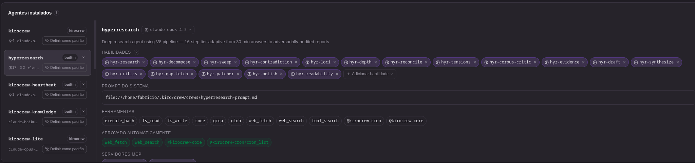

<h1 align="center">🚀 KiroCrew Ports</h1>

<p align="center">
  <strong>Production-grade AI agent frameworks, reimplemented as native KiroCrew components</strong>
</p>

<p align="center">
  <a href="#available-ports">Ports</a> •
  <a href="#installation">Install</a> •
  <a href="#philosophy">Philosophy</a> •
  <a href="#contributing">Contribute</a>
</p>

<p align="center">
  
  
  
</p>

---

## What is this?

This repository contains **ports** of popular AI agent frameworks to [KiroCrew](https://kirocrew.com). Each port reimplements the original project as KiroCrew-native components — agents, skills, and prompts — with **zero external dependencies**.

No Python packages. No npm. No CLIs to install. Just markdown skill files and JSON agent configs that work directly in KiroCrew.

---

## Available Ports

| Port | Original Project | Components | Status |
|:-----|:-----------------|:-----------|:-------|
| **[HyperResearch](./hyperresearch/)** | [jordan-gibbs/hyperresearch](https://github.com/jordan-gibbs/hyperresearch) | 18 skills, 1 agent | ✅ Complete |
| **[MarketingSkills](./marketingskills/)** | [coreyhaines31/marketingskills](https://github.com/coreyhaines31/marketingskills) | 9 agents, 9 prompts | ✅ Complete |

<p align="center">
  
  <br>
  <em>Example: HyperResearch generating a 5,460-word research report with 50 citations</em>
</p>

---

## Installation

### Let KiroCrew Do It For You

The easiest way to install a port is to ask your KiroCrew agent:

```
Clone the kirocrew-ports repo from GitHub (fabricioctelles/kirocrew-ports) 
and install the HyperResearch port for me
```

or for MarketingSkills:

```
Install the MarketingSkills port from fabricioctelles/kirocrew-ports
```

KiroCrew will clone the repo, run the install script, and configure everything automatically.

### Quick Start (Manual)

Each port has its own install script:

```bash
# Clone the repo
git clone https://github.com/fabricioctelles/kirocrew-ports.git
cd kirocrew-ports

# Install HyperResearch (skills-based)
cd hyperresearch && ./install.sh

# Install MarketingSkills (agents-based)
cd marketingskills && ./install.sh
```

### Manual Installation

#### Skills (HyperResearch style)
```bash
cp -r <port>/skills/* ~/.kiro/crew/skills/
```

#### Agents (MarketingSkills style)
```bash
# 1. Copy agent definitions (note: ~/.kiro/agents/, not ~/.kiro/crew/agents/)
cp <port>/agents/*.json ~/.kiro/agents/

# 2. Copy prompts
cp <port>/prompts/*.md ~/.kiro/crew/prompts/

# 3. Merge agent bindings into config.json
# See each port's config-fragment.json for the bindings to add
```

---

## Post Install Procedure

After installing a port, **review the agent model configurations** to match your subscription and preferences.

<p align="center">
  
  <br>
  <em>KiroCrew Dashboard: Agent configuration with model selection and skills</em>
</p>

### Check Installed Agents

```bash
# List installed agents from this port
ls ~/.kiro/agents/mkt-*.json ~/.kiro/agents/marketingcrew.json 2>/dev/null
ls ~/.kiro/agents/hyperresearch.json 2>/dev/null
```

### Review Model Settings

Each agent JSON file contains a `model` field. The defaults use high-capability models, but you may want to adjust based on:

- **Your API subscription tier** (some models require specific plans)
- **Cost optimization** (smaller models for simpler tasks)
- **Speed vs quality tradeoffs**

```bash
# Check current model for an agent
cat ~/.kiro/agents/mkt-seo.json | grep model

# Or review in the KiroCrew dashboard:
# Settings → Agents → [agent name] → Model
```

### Common Model Alternatives

| Default | Lighter Alternative | Use Case |
|---------|---------------------|----------|
| `claude-sonnet-4-20250514` | `claude-haiku-3-20240307` | Cost-sensitive tasks |
| `claude-opus-4-20250514` | `claude-sonnet-4-20250514` | Balance cost/quality |

Edit the agent JSON directly or use the KiroCrew dashboard to change models.

---

## KiroCrew Architecture Quick Reference

Understanding where files go:

| Component | Location | Format |
|-----------|----------|--------|
| **Kiro Agents** | `~/.kiro/agents/*.json` | JSON |
| **Agent Bindings** | `~/.kiro/crew/config.json` → `agents` section | JSON |
| **System Prompts** | `~/.kiro/crew/prompts/*.md` | Markdown |
| **Skills** | `~/.kiro/crew/skills/<name>/SKILL.md` | Markdown |

### What is a "Crew"?

In KiroCrew, **a crew is simply an agent with non-empty `triggers`**. There is no separate crew file format. The `select_crew` tool routes to agents based on their triggers.

### Common Misconceptions

| ❌ Does NOT Exist | ✅ Reality |
|-------------------|-----------|
| `~/.kiro/crew/agents/` | Agents go in `~/.kiro/agents/` |
| `crews/*.yaml` | Crews are agents with triggers in config.json |
| `knowledge://` protocol | Use Knowledge Library ingestion |

---

## Philosophy

<table>
<tr>
<td width="50%">

### ❌ What we DON'T do

- Wrap external CLIs
- Require Python/Node runtimes
- Add dependency hell
- Force you to learn new tools

</td>
<td width="50%">

### ✅ What we DO

- Reimplement as pure skills/agents
- Use native KiroCrew patterns
- Zero dependencies
- Full attribution to originals

</td>
</tr>
</table>

---

## Port Structure

Each port follows this structure:

```
<port-name>/
├── README.md             # Port documentation
├── install.sh            # Installation script
├── config-fragment.json  # Agent bindings to merge into config.json
├── docs/
│   ├── MAPPING.md        # Original → KiroCrew mapping
│   └── DECISIONS.md      # Architectural decisions
├── agents/               # Kiro agent JSON files (if agent-based)
├── prompts/              # System prompt markdown files (if agent-based)
└── skills/               # SKILL.md files (if skill-based)
```

### Port Types

| Type | Example | Primary Components |
|------|---------|-------------------|
| **Skill-based** | HyperResearch | Many skills in `~/.kiro/crew/skills/` |
| **Agent-based** | MarketingSkills | Agents in `~/.kiro/agents/` with prompts |

---

## Contributing

Want to port another framework? See [CONTRIBUTING.md](CONTRIBUTING.md) for guidelines.

Quick checklist:
1. Study the original project's architecture
2. Map components to KiroCrew equivalents
3. Create skills or agents using native file formats
4. Document decisions and tradeoffs
5. Include a working `install.sh`
6. Submit a PR

---

## Updates

Each port is based on a **specific commit** of the original project. When upstream projects release updates:

1. Compare the original repo's changes against the ported version
2. Manually adapt affected skills/agents
3. Update the port's `Upstream Tracking` section
4. Submit a PR

Check each port's README for its specific upstream commit.

---

## License

MIT — Individual ports may have additional attribution requirements from their original projects.

---

<p align="center">
  <sub>Built with ❤️ for the KiroCrew community</sub>
</p>

---

## Author

**Fabricio Telles**  
🌐 [ft.ia.br](https://ft.ia.br)
